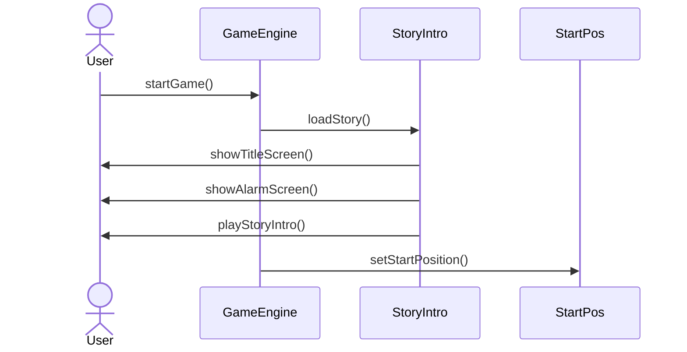
```mermaid
sequenceDiagram
    actor U as User
    participant GE as GameEngine
    participant SI as StoryIntro
    participant SP as StartPos


    U->>GE: startGame()
    GE->>SI: loadStory()
    SI->>U: showTitleScreen()
    SI->>U: showAlarmScreen()
    SI->>U: playStoryIntro()
    GE->>SP: setStartPosition()

```

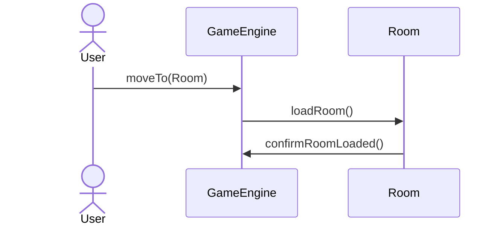
```mermaid
sequenceDiagram
    actor U as User
    participant GE as GameEngine
    participant R as Room


    U->>GE: moveTo(Room)
    GE->>R: loadRoom()
    R->>GE: confirmRoomLoaded()

```

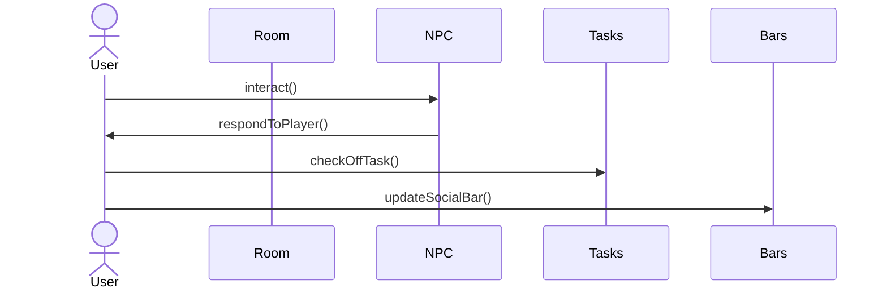
```mermaid
sequenceDiagram
    actor U as User
    participant R as Room
    participant N as NPC
    participant T as Tasks
    participant B as Bars


    U->>N: interact()
    N->>U: respondToPlayer()
    U->>T: checkOffTask()
    U->>B: updateSocialBar()

```

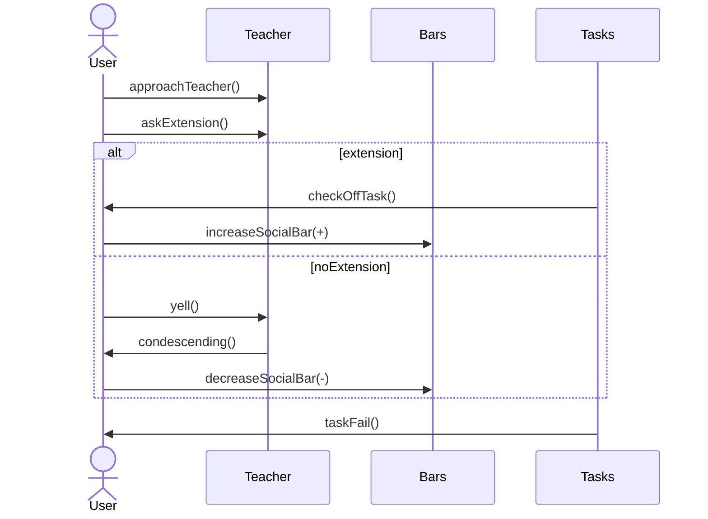
```mermaid
sequenceDiagram
    actor U as User
    participant T as Teacher
    participant B as Bars
    participant Task as Tasks


    U->>T: approachTeacher()
    U->>T: askExtension()
    alt extension
        Task->>U: checkOffTask()
        U->>B: increaseSocialBar(+)
    else noExtension
        U->>T: yell()
        T->>U: condescending()
        U->>B: decreaseSocialBar(-)
    end
    Task->>U: taskFail()
```

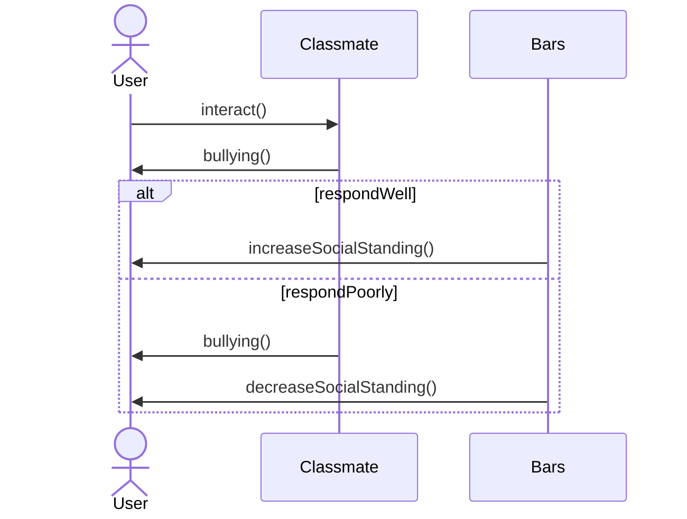
```mermaid
sequenceDiagram
    actor U as User
    participant C as Classmate
    participant B as Bars


    U->>C: interact()
    C->>U: bullying()
    alt respondWell
        B->>U: increaseSocialStanding()
    else respondPoorly
        C->>U: bullying()
        B->>U: decreaseSocialStanding()
    end

```

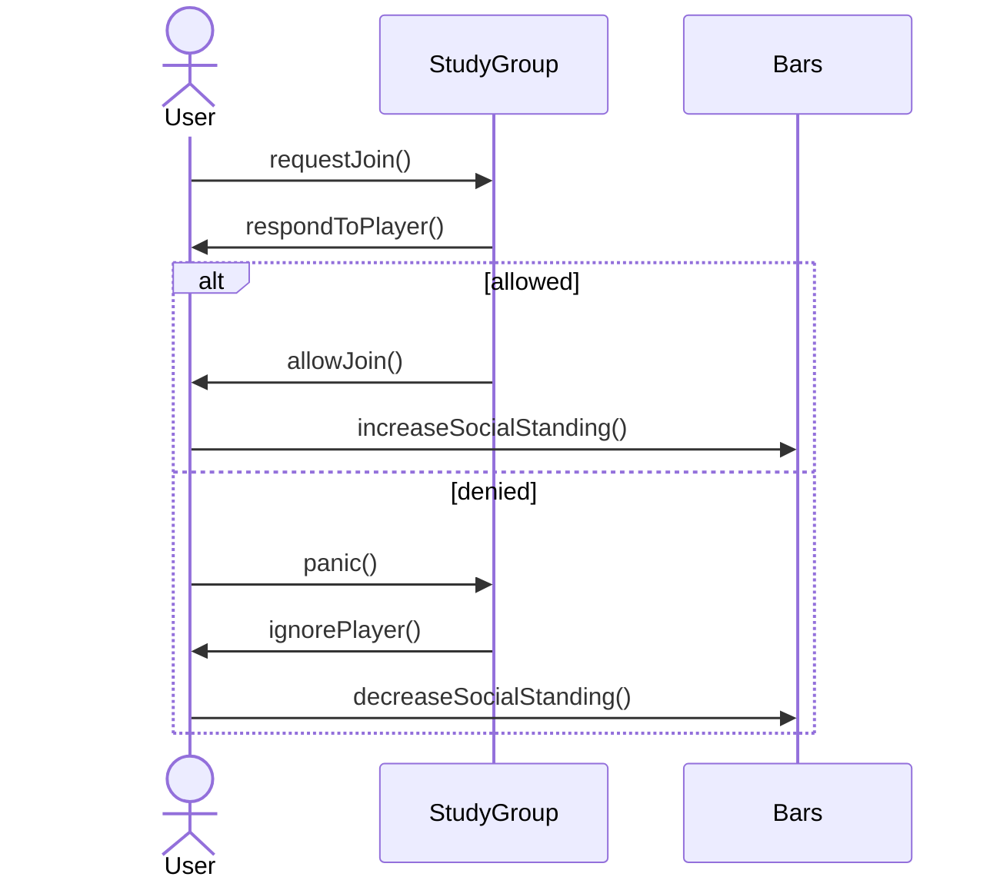
```mermaid
sequenceDiagram
    actor U as User
    participant SG as StudyGroup
    participant B as Bars


    U->>SG: requestJoin()
    SG->>U: respondToPlayer()
    alt allowed
        SG->>U: allowJoin()
        U->>B: increaseSocialStanding()
    else denied
        U->>SG: panic()
        SG->>U: ignorePlayer()
        U->>B: decreaseSocialStanding()
    end

```

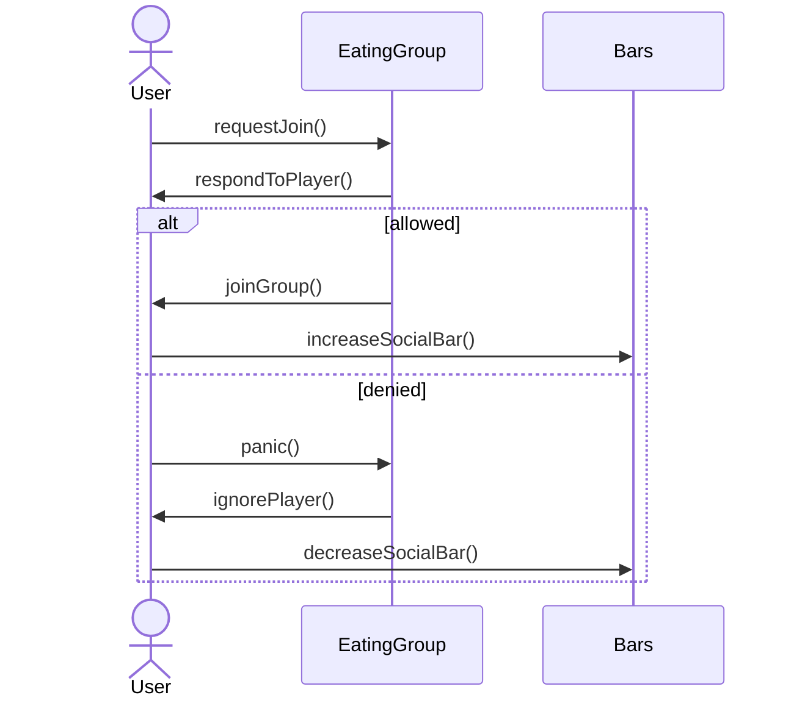
```mermaid
sequenceDiagram
    actor U as User
    participant EG as EatingGroup
    participant B as Bars


    U->>EG: requestJoin()
    EG->>U: respondToPlayer()
    alt allowed
        EG->>U: joinGroup()
        U->>B: increaseSocialBar()
    else denied
        U->>EG: panic()
        EG->>U: ignorePlayer()
        U->>B: decreaseSocialBar()
    end

```

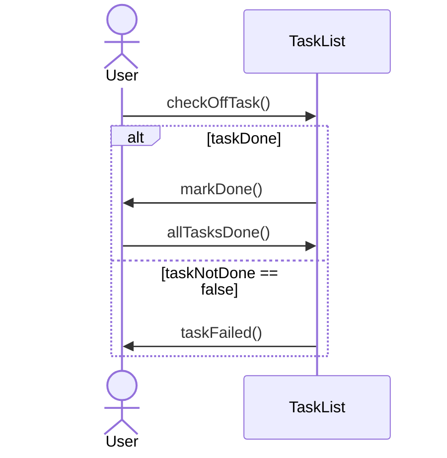
```mermaid
sequenceDiagram
    actor U as User
    participant TL as TaskList


    U->>TL: checkOffTask()
    alt taskDone
        TL->>U: markDone()
        U->>TL: allTasksDone()
    else taskNotDone == false
        TL->>U: taskFailed()
    end

```

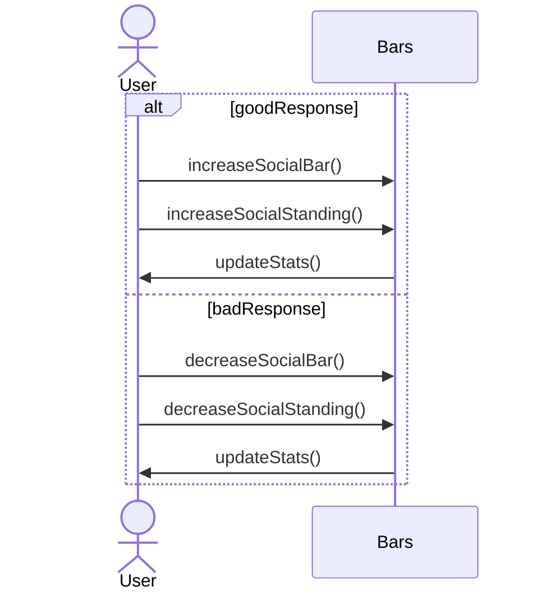
```mermaid
sequenceDiagram
    actor U as User
    participant B as Bars


    alt goodResponse
        U->>B: increaseSocialBar()
        U->>B: increaseSocialStanding()
        B->>U: updateStats()
    else badResponse
        U->>B: decreaseSocialBar()
        U->>B: decreaseSocialStanding()
        B->>U: updateStats()
    end

```

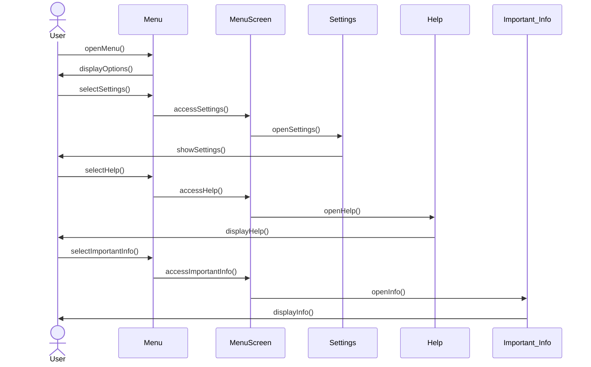
```mermaid
sequenceDiagram
    actor U as User
    participant M as Menu
    participant MS as MenuScreen
    participant S as Settings
    participant HI as Help
    participant II as Important_Info


    U->>M: openMenu()
    M->>U: displayOptions()


    U->>M: selectSettings()
    M->>MS: accessSettings()
    MS->>S: openSettings()
    S->>U: showSettings()


    U->>M: selectHelp()
    M->>MS: accessHelp()
    MS->>HI: openHelp()
    HI->>U: displayHelp()


    U->>M: selectImportantInfo()
    M->>MS: accessImportantInfo()
    MS->>II: openInfo()
    II->>U: displayInfo()
```

 
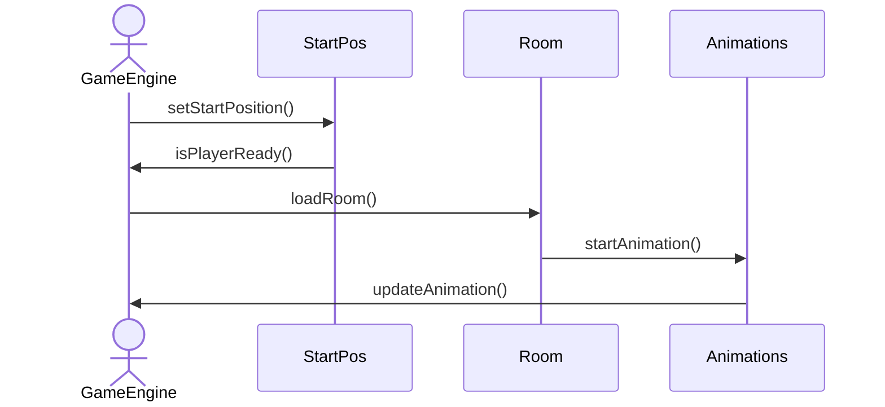
```mermaid
sequenceDiagram
    actor GE as GameEngine
    participant SP as StartPos
    participant R as Room
    participant A as Animations


    GE->>SP: setStartPosition()
    SP->>GE: isPlayerReady()
    GE->>R: loadRoom()
    R->>A: startAnimation()
    A->>GE: updateAnimation()

```

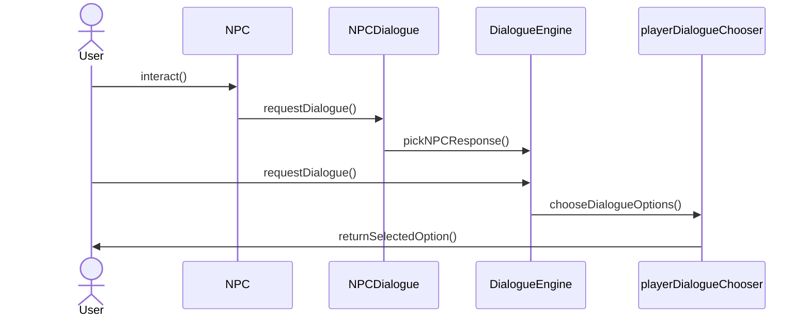
```mermaid
sequenceDiagram
    actor U as User
    participant N as NPC
    participant ND as NPCDialogue
    participant DE as DialogueEngine
    participant UD as playerDialogueChooser

    U->>N: interact()
    N->>ND: requestDialogue()
    ND->>DE: pickNPCResponse()
    U->>DE: requestDialogue()
    DE->>UD: chooseDialogueOptions()
    UD->>U: returnSelectedOption()
```
