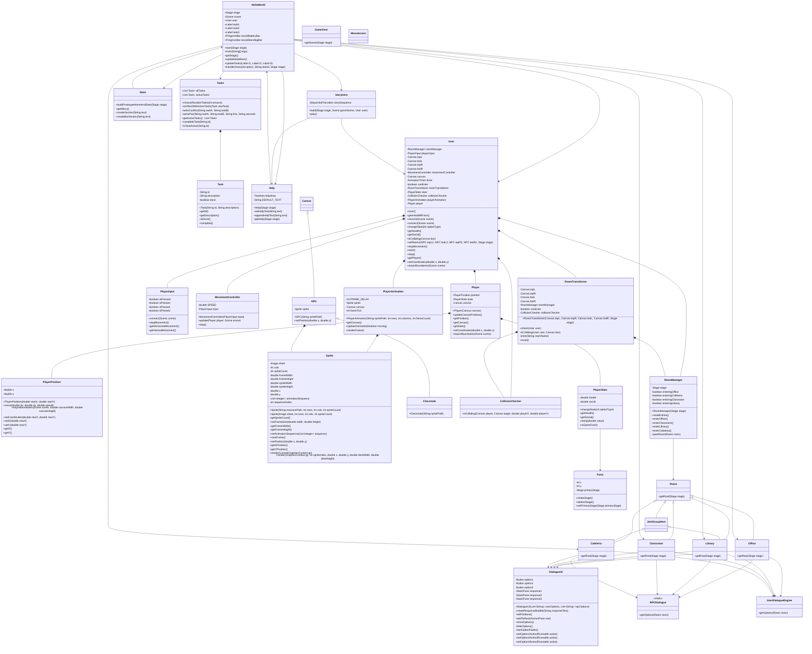

# Updated Design

## Class Diagram: Original

```mermaid
classDiagram
    Person <|-- User
    Person <|-- NPC
    Person : +int age
    Person : +String gender
    Person: -double xPosition
    Person: -double yPosition
    Person: +Sprite sprite

    NPC <|-- Teacher
    NPC <|-- Classmate
    NPC <|-- StudyGroup
    NPC <|-- EatingGroup
    NPC --> NPCDialogue
    NPC : -NPCDialogue dialogue
    NPC: -showResponse()
    NPC: +startDialogue()
    NPC: +reactToPlayer()
    NPC: +requestDialogue()
    class NPC{
      +random_Movement()
      +bullying()
      +allowJoin()
      +ignorePlayer()
      +joinGroup()
    }

    MenuScreen <|-- Settings
    class Settings{
        +openSettings()
    }
    MenuScreen <|-- Important_Info
    class Important_Info{
      -Text textInfo
    }
    MenuScreen <|-- Menu
    class Menu{
      +openMenu()
      +displayOptions()
      +showSettings()
      +displayHelp()
      +displayInfo()
    }
    MenuScreen <|-- Help
    class Help{
      -Text helpInfo
    }
    class MenuScreen{
        +show()
        +hide()
        +selectMenu()
        +selectSettings()
        +selectHelp()
        +selectImportantInfo()
    }

    Room <|-- Office
    Room <|-- FindGroupHere
    FindGroupHere <|--Cafeteria
    FindGroupHere <|--Library
    Room <|-- Classroom
    class Room{
        +double width
        +double height
        +ArrayList<NPC> npcs
        +ArrayList<Task> tasks
        +String roomName
        +Sprite background
        +loadRoom()
    }

    class Office{
      +Teacher counselor
    }
    class Library{
      +StudyGroup studyGroup
    }
    class Cafeteria{
      +EatingGroup eatingGroup
    }
    class Classroom{
      +Teacher teacher
    }

    class Teacher{
      -int trustLevel
      +condescending()
      +evaluateStudent()
      +approachTeacher()
      +askExtension()
      +yell()
    }

    class Classmate{
      -int bullyLevel
      -int respectLevel
      +bullying()
      +interact()
    }

    class StudyGroup{
      +boolean allowJoin
      -ignorePlayer()
      +evaluatePlayer()
      +interact()
      +requestJoin()
      +panic()
    }

    class EatingGroup{
      +boolean allowJoin
      -ignorePlayer()
      +interact()
      +requestJoin()
      +panic()
    }

    User --> Tasks
    class Tasks{
      +boolean allTasksDone
      -boolean isTaskDone
      +checkOffTask()
      +markDone()
      +taskFailed()
    }

    class TasksList{
        -ArrayList<Task> various_Tasks
    }

    User --> Bars
    class Bars{
        -int socialBar
        -int socialStanding
        +decrease_socialBar()
        +decrease_socialStanding()
        +increase_socialBar()
        +increase_socialStanding()
        +getSocialBar()
        +getSocialStanding()
        +renderBar()
    }
    User --> Stats
    class Stats {
        -double socialBattery
        -double socialStanding
        +increaseStanding()
        +decreaseStanding()
        +increaseBattery()
        +decreaseBattery()
    }
    class User{
      +move()
      +select()
      +interact()
      +respondToPlayer()
      -ArrayList<Task> tasks
      +taskFail()
      +taskSucceed()
    }

    NPCDialogue: -ArrayList<String>npcDialogue
    NPCDialogue: +getDialogue()
    NPCDialogue: +getRandomDialogue()

    DialogueEngine --> playerDialogueChooser
    DialogueEngine --> NPCDialogue
    DialogueEngine: +startDialogue()
    DialogueEngine: +processChoice()
    DialogueEngine: +updateStats()
    DialogueEngine: +batteryImpact()
    DialogueEngine: +standingImpact()
    DialogueEngine: +endDialogue()
    DialogueEngine: +provideResponse()

    playerDialogueChooser: +displayChoices()
    playerDialogueChooser: +getPlayerChoice()

    StoryIntro --> Title
    StoryIntro --> Alarm
    StoryIntro --> Story
    class StoryIntro {
       -loadStory()
       -nextScene()
       -showTitleScreen()
       -showAlarmScreen()
       -playStoryIntro()
     }
   
    class playerDialogueChooser{
      +chooseDialogueOptions()
      +returnSelectedOption()
    }
   
    class DialogueEngine{
      -ArrayList npcDialogue
      -ArrayList userDialogue
    }

    class NPCDialogue{
      +requestDialogue()
      +pickNPCResponse()
    }

    class StartPos{
        setStartPosition()
    }

    GameEngine <|-- StartPos
    GameEngine <|-- StoryIntro

    class GameEngine{
        +Scene scene
        +Stage stage
        +startGame()
        +switchScene()
        +loadRoom()
        +updateGame()
        +updateAnimation()
        +enterRoom()
        +moveTo(Room)
        +confirmRoomLoaded()
    }
    
    class Animations{
      +startAnimation()
      +updateAnimation()
    }

```

## Class Diagram Final

## Class Diagram: Reflection

From the class diagrams we had before, we learned a lot as we coded the project. Although it gave us a clear path on how we wanted to structure our code, many changes were made throughout the development process. 

One major change was the reduction of unneccesary classes. Originally, classes such as Person, Teacher, StudyGroup, EatingGroup, and several specialized NPC subclasses were planned. In the final implementation, though, we realized that these NPCs actually didn't need separate classes to themselves and could be condensed into one, making the process easier and if any changes specific to the NPCs needed to be made, it would be easy to change.

Another major change was the splitting of God classes. When we ran the CPD and the PMD files, the main error we kept getting was the fact that the User and the HelloWorld class way too many methods, breaking the SRP rules of Object Oriented Programming. To fix this, we split HelloWorld into HelloWorld, CollisionChecker, and MovementController. Also, we split User into PlayerAnimation, PlayerStats, PlayerPosition, and PlayerInput. From this, we learned that when making class diagrams, instead of splitting classes into different sections of the game, we should delve even deeper into what the responsibilities of the classes will be and it'll be more reliable.

Overall, the things to keep in mind and take into account when creating designs for programs in the future are to not assign classes into something that could be condensed into a single method to reduce the complexity and improve efficiency of the code. At the same time, we also learned that splitting large classes into multiple focused classes is beneficial because it allows responsibilities to be separated clearly while still working together to perform larger tasks.

# Final Features

| Expected Core Features | Actual Features Implemented |
|---|---|
| Players are able to move left, right, and turn around, they should be able to move to various classrooms. | ✅ Students are able to move left and right and enter a room by navigating to the door or clicking on the door. |
| Static dialogue options, where the next outcome (or response) is based on which answer/dialogue is selected | ✅For every dialogue, the user has three possible responses. One of them increases the health bar (and decreases the social bar), one of them increases the social bar (and decreases the health bar), and one of them decreases both. |
| Player should be able to look straight ahead | ✅The player can look straight ahead. |
| Blank start screen that has an option to go to the help menu. | ⚠️Our plan significantly changed, we now start with a story (an alarm screen) and a few images that take us through the players morning journey and then it goes to the start screen. |
| Task List where users are given a list of 3-5 tasks that they are expected to complete successfully. | ✅The player is able to access their tasks in a list and the tasks check off when they are completed. |
| When the player is in the office, they should be able to meet their counselor. | ✅When the player is in the office, they can click on the “see counselor button” to see their counselor. (Improvement) |
| When the student is in the classroom, they should have the option to turn in their homework. | ✅When the student is in the classroom, they have the option to click on the turn in pile to turn in their homework. (Improvement) |
| When the student is in the classroom they should be able to solve the problem on the board. | ✅When the student is in the room, they can click on the whiteboard to solve the problem. (Improvement) |
| When the student is in the cafeteria, they can get food. | ✅When the student is in the cafeteria, they can click on the food section to enter the line. (Improvement) |
| When the student is in the library, they can join a study group. | ✅When the student is in the library they can click on the study group to join. (Improvement) |
| When the student is in the library, they can check out a book. | ✅When the student is the in library they can click on the bookshelf to check out a book. (Improvement) |
| Update health and social bars | ✅Social and health bars updated based on which dialogue is chosen. |
| STRETCH: Panic feature where the screen shakes when the health or social bar becomes low | ✅Implemented where the screen does no stop shaking so it becoems harder to implement certain tasks. |

# Lessons Learned

## Lessons Learned: Goals

| Original Learning Targets/Goals | Actual Goals Achieved |
|---|---|
| Learn how to code User and NPC interactions | We learned how to use the `Duration` class and the `FadeTransition` class for the User to click their dialogue options and for the NPCs’ responses, we learned how to efficiently use `setOnAction()` methods to simulate speaking to somebody or having a conversation with somebody. |
| Get comfortable with arrays and autoupdating them | We used arrays and lists throughout the project to update gameplay. Examples include storing and updating active tasks, dialogue choices, animation sequences, and NPC responses. Along with that, we also combined our knowledge of arrays with our current knowledge of maps for the NPC responses. |
| Learn to switch screens smoothly | We successfully implemented smooth screen and scene transitions throughout the game using JavaFX scenes and stages, especially when transitioning between the intro scene, because we were aiming for almost a video montage look during that. We also created systems such as `RoomManager` and `RoomTransitioner` to organize room switching more efficiently and reduce repeated code. |
| Improve debugging and problem solving skills | When we made our classes, we encountered issues such as classes that didn’t follow SRP (too many responsibilities), duplicated code, and transition bugs. Using PMD and CPD reports helped us identify these problems and restructure the code into smaller, more maintainable classes that made our code more readeble. |
| Create task system with random selection | When we started the project, we wanted a variety of tasks that would circulate, so that the user would not get bored of the game and it can be replayed. To do this, we used a static `ArrayList` with all the tasks and made sure there was no overlap, so user gets to visit at least 3 of the rooms. |

## Lessons Learned: Our Story

| Person | Individual Lesson |
|---|---|
|Sreshta|Throughout this project, I learned so much from how to communicate effectively to learning how to use classes I had never heard of before. Some unexpected setbacks that we had were the number of merge conflicts that we had. We have three people in our team and we are all dedicated to doing our tasks on time, so everytime we submitted something, we had to call or text each other everytime we were going to push all our changes. Some skills I hope to continue to develop are designing wireframes, class diagrams, and sequence diagrams because they helped us design our prototype, which made it less overwhelming to build our core game and then take it to the next level with stretch features. However, because our diagrams look very different before and after implementation, my skills on that could use work. Finally, balancing my work across tasks was difficult because sometimes, our sprints were loaded with work and sometimes our sprints were pretty calm and we got our work done comfortably. However, with my team’s support, I was motivated to work hard and get all my work done on time.|
|Gagana|This project has taught me how to be open to others ideas. When beginning this project in the brainstorming phase, we each had such unique perspectives that we were struggling to merge. However, I feel that the three of us were able to grow as a team as we learned how to effectively communicate our ideas and be honest with each other while being respectful. As for the technical portion of the project, I learned the importance of planning thoroughly. The class diagrams and sequence diagrams became much more useful than I thought they would. Similarly, it is important to be open to change. Our class diagram changed significantly as we added and deleted a total of around 12 classes. This taught me to be flexible and learn this project was built through an iterative process. I gained a deeper understanding on how to layer backgrounds with text to ensure the users had a clear experience while being able to complete their tasks with little difficulty. Overall, I felt that this was a valuable project and I would like to take the skills I learned about design documents forward to future projects. |
|Aadi|This project has helped me learn effective communication, better time management and planning, and how to ask for help when I need it. An unexpected setback we often faced was that our code would break due to automatic JSON changes, and therefore we’d often have to work around that, finding out exactly what had changed so that we could adapt our code as needed. Some skills I want to retain and improve are pixel spriting and pixel art, as well as practicing with new classes and ways of coding; more specifically, I want to practice my self-learning of different things in not only Java, but programming languages in general and other subjects, as self-study is important in real-world contexts. While my spriting looked alright in the end, I feel like it took too long and it can definitely be improved; therefore, I want to improve in order to reduce my time while getting better results overall. Finally, as I generally have trouble with time management and often hesitate to ask for help, balancing work and tasks was rather difficult for me. Because I reached out to Mr. Rukman and obtained his help and support, the work became much more manageable for me.|

# Journal Summary

In this development process of our game, all of us, collectively, gained many valuable skills that will greatly help us in the future. The main skills that we will focus on are choosing JavaFX layout systems, choosing between complex data structures, incorporating OOP, and learning about new classes and variables.

One of the biggest things was learning how to use the JavaFX layout systems properly, like when to use AnchorPane for precise positioning (like for our main hallway screen), and when to use StackPane for layering UI elements (like dialogue boxes on screens). StackPane showed up especially in the rooms (Library, Cafeteria, Classroom, Office) where we had to place NPCs, click areas, and overlay shapes, so everything was ordered like it should, giving the screen dimension and good flow. 

Another major skill we developed was working with more complex data structures like Maps and ArrayLists. We used the Maps mainly in systems like UserDigalogueEngine and NPCDialogue to connect each room to its specific dialogue options, which made the code cleaner and easier to manage than using long chains of conditionals. We used ArrayLists to keep track of the tasks, mainly in storing the ones that are active and the ones that are complete. We also used them in animation sequences and updating game statistics, so that the game would feel dynamic to users.

Furthermore, we were able to incorporate all 4 of the java principles (Encapsulation, Abstraction, Inheritance, Polymorphism) into our game. At the start, we had issues with God classes like User and HelloWorld handling way too many behaviors, which made problem-solving harder as most of the problems would reside in these classes, but we couldn’t pinpoint where exactly the class was causing the problem. However, learning how to use PMD and CPD helped us identify these problems and we ended up splitting the responsibilities into 4 whole new classes (along with the existing class). These include User splitting into PlayerInput, PlayerStats, PlayerAnimation, and PlayerMovement. This made the code significantly more readable and manageable, so splitting these classes is definitely one of the most valuable skills that we learned.

Specific to JavaFx, we unlocked many new classes like FadeTransition and Duration that made the transitions in our game way cooler, more dynamic, and more interesting to look at and play. These classes helped us create timed effects for dialogue options, which allowed us to simulate more realistic interactions, like options fading at different speeds to represent different consequences. 

We were also able to effectively use enums in our classes. Two classes where we used this were the NPCDialogue Class and the UserDialogueEngine class. Because the Room could only be one of 5 values (Office, Library, Cafeteria, Classroom_homeowrk, and Classroom_problem) using an enum prevented invalid rooms. We used it to make sure that the correct dialogues were shown in the correct rooms. For example, using Room.OFFICE ensured that the player could access the dialogue options for the Office room. This was in the UserDialogueEngine Class. In the NPCDialogue class, we did something similar by making sure the correct NPC dialogues showed up in the correct rooms.

Finally, another skill we all unanimously agree is the most valuable is dealing with bugs that were unheard of, especially while dealing with merge conflicts and testing tools flagging our code for having too much. However, learning to work as a group by consistently coordinating the pushes and pulls fostered more unity within our team, enabling us to work extremely well together.

Overall, by learning things all the way from complex coding strategies to simply working with a team, this project taught all of us very valuable lessons that led to us creating an amazing final product that we are all proud of.
